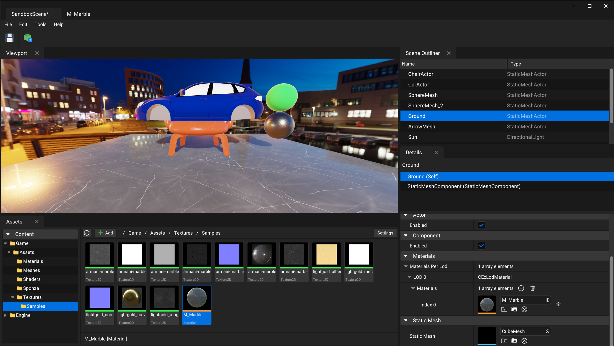

# Crystal Engine

A WIP cross-platform Vulkan game engine with PBR rendering, Directed Acyclic FrameGraph based render architecture, and a declarative syntax Widget UI framework (called **Fusion**) built entirely from scratch that is used for both editor UI and run-time screen space UI.

### ⭐ Feel free to star the project to show your support!




### Check out [Fusion widget library](./Docs/FusionWidgets.md).

Join discord server here:
https://discord.gg/TXGWUrFarx

## 🚀 Key Highlights

- 🔧 **Cross-platform Vulkan game engine** supporting Windows, macOS (Apple Silicon), and Linux.
- 🎨 **Fusion UI framework** — a fully custom-built, **DPI-aware**, cross-platform **declarative** C++ UI system (no ImGui or Qt), used for both runtime and editor UIs.
- 🧩 **Advanced docking system** — Fusion supports nested vertical/horizontal splits and tabbed views.
- 🎨 **Fusion** supports features like drawing images, gradients, custom transformations, data binding, and many more.
- 🛠️ **Directed Acyclic FrameGraph-based GPU scheduler** with automatic resource tracking and dependencies.
- 💡 **HLSL shader support** for Vulkan via DxCompiler.
- 📦 Multi-threaded **asset processing pipeline** with binary asset generation and automatic dependency tracking.
- 🔍 Custom-built automatic **C++ reflection**, **serialization**, and **runtime object system** — no third-party metadata libraries.
- 🖼️ Forward PBR render pipeline with CubeMap IBLs.

## Docking Demo

https://github.com/user-attachments/assets/3bba7231-7a4a-4616-8cc8-d218377d128a

## Requirements

The engine and editor compiles and runs on **Windows (x64)**, Mac (Apple Silicon) and Linux (Ubuntu).

**Note**: Linux support is experimental, and I have not built on Linux for a while.

## Building

Clone the repo using following command:

```sh
git clone --recursive https://github.com/neelmewada/CrystalEngine.git

# Or if you want to clone submodules after cloning this repo:
git submodule update --init --recursive
```

Please look at the [Build.md](./Docs/Build.md) to know the steps & dependencies required to build.

## Layered Architecture

The engine is divided into different layers as shown below, and each layer can have multiple modules. Left side is for standalone build and right side is for editor builds.


### Core layer
All modules inside the core layer are at the low level of the engine.

* **Core**: The foundation of the engine. Provides runtime type reflection system, Binary & JSON serialization, containers, Object system, Job System, etc.
* **CoreApplication**: Low level application layer to handle OS specific application, windowing and input. Uses SDL2 underneath the abstractions.
* **CoreMedia**: Low level image handling and BC1-7 compression.
* **CoreMesh**: Low level mesh loading.
* **CoreShader**: Low level shader compilation and reflection. Uses DxCompiler & spirv reflect.
* **CoreRHI**: Rendering Hardware Interface. A graphics API abstraction layer that is used for low level GPU operations. Also implements frame graph rendering.
    * **VulkanRHI**: Vulkan implementation of the RHI layer.
* **CoreRPI**: Render Pipeline Interface. Provides a render pipeline architecture layer on top of RHI, allowing engine to build complex render pipeline with many passes.
* **FusionCore**: Widgets library used to build GUI applications with declarative syntax.
* **Fusion**: Adds more high level Fusion widgets like TreeView, ListView and more.

### Engine layer

Engine layer modules are at high level of the engine.

* **Engine**: The main module that contains the high level game engine systems, game framework, etc.
* **GameEngine**: Only for standalone builds. Runtime implementation of System module.

### Editor layer

Contains all the editor modules.

* **EditorCore**: Implements Asset processing and serves as the foundation of the editor & host tools.
* **EditorEngine**: Host/editor implementation of the Engine module.
* **CrystalEditor**: Contains all the editor related GUI and features and uses Fusion for the widgets.

# Screenshots

### Material Editor


### Color Picker


### Project browser window:


--- 
### Credits

<a href="https://www.flaticon.com/">Icons by FlatIcon - flaticon.com</a>

This project includes some code, both original and modified, from the O3DE project (https://github.com/o3de/o3de) under the MIT License.

Other than that, all the systems in the engine, like object system, Reflection, Serialization, Fusion Widget library, etc. are entirely our own implementation. While it may draw conceptual inspiration from other frameworks, all code and algorithms have been developed independently.

