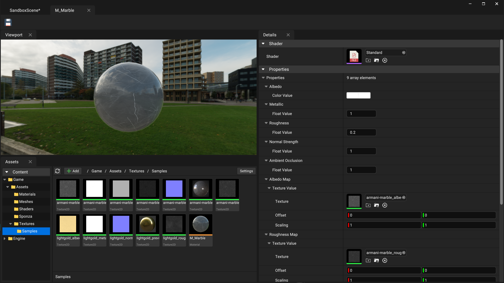

# Crystal Engine

A WIP cross-platform Vulkan game engine with PBR rendering, Directed Acyclic FrameGraph based render architecture, and a declarative syntax Widget UI framework (called **Fusion**) built entirely from scratch that is used for both editor UI and run-time screen space UI.

### ⭐ Feel free to star the project to show your support!


### Check out [Fusion widget library](./Docs/FusionWidgets.md).

Join discord server here:
https://discord.gg/TXGWUrFarx

## Requirements

The engine and editor compiles and runs on **Windows (x64)**, Mac (Apple Silicon) and Linux (Ubuntu).

**Note**: Linux support is experimental, and I have not built on Linux for a while.

## Building

Clone the repo using following command:

```sh
git clone --recursive https://github.com/neelmewada/CrystalEngine.git

# Or if you want to clone submodules after cloning this repo:
git submodule update --init --recursive
```

Please look at the [Build.md](./Docs/Build.md) to know the steps & dependencies required to build.

## Features

- Layered engine architecture with cross platform support.
- Use HLSL to write shaders for Vulkan.
- Forward PBR rendering with CubeMap IBL.
- Directional shadow maps.
- Multi-threaded job system, used in Asset Processing.
- Asset processing to generate binary assets for use by engine.
- Automatic C++ runtime reflection generation.
- Object serialization: Custom binary format and JSON.
- Frame graph based GPU scheduling with automatic resource dependencies.
- **Fusion** framework for declarative GUI apps with text rendering.
- **Fusion** uses the engine's builtin renderer instead of 3rd party imgui frameworks.

## Layered Architecture

The engine is divided into different layers as shown below, and each layer can have multiple modules. Left side is for standalone build and right side is for editor builds.


### Core layer
All modules inside the core layer are at the low level of the engine.

* **Core**: The foundation of the engine. Provides runtime type reflection system, Binary & JSON serialization, containers, Object system, Job System, etc.
* **CoreApplication**: Low level application layer to handle OS specific application, windowing and input. Uses SDL2 underneath the abstractions.
* **CoreMedia**: Low level image handling and BC1-7 compression.
* **CoreMesh**: Low level mesh loading.
* **CoreShader**: Low level shader compilation and reflection. Uses DxCompiler & spirv reflect.
* **CoreRHI**: Rendering Hardware Interface. A graphics API abstraction layer that is used for low level GPU operations. Also implements frame graph rendering.
    * **VulkanRHI**: Vulkan implementation of the RHI layer.
* **CoreRPI**: Render Pipeline Interface. Provides a render pipeline architecture layer on top of RHI, allowing engine to build complex render pipeline with many passes.
* **FusionCore**: Widgets library used to build GUI applications with declarative syntax.
* **Fusion**: Adds more high level Fusion widgets like TreeView, ListView and more.

### Engine layer

Engine layer modules are at high level of the engine.

* **Engine**: The main module that contains the high level game engine systems, game framework, etc.
* **GameEngine**: Only for standalone builds. Runtime implementation of System module.

### Editor layer

Contains all the editor modules.

* **EditorCore**: Implements Asset processing and serves as the foundation of the editor & host tools.
* **EditorEngine**: Host/editor implementation of the Engine module.
* **CrystalEditor**: Contains all the editor related GUI and features and uses Fusion for the widgets.

# Screenshots

### Material Editor



### Color Picker


### Project browser window:


--- 
### Credits

<a href="https://www.flaticon.com/">Icons by FlatIcon - flaticon.com</a>

This project includes some code, both original and modified, from the O3DE project (https://github.com/o3de/o3de) under the MIT License.

Other than that, all the systems in the engine, like object system, Reflection, Serialization, Fusion Widget library, etc. are entirely our own implementation. While it may draw conceptual inspiration from other frameworks, all code and algorithms have been developed independently.

